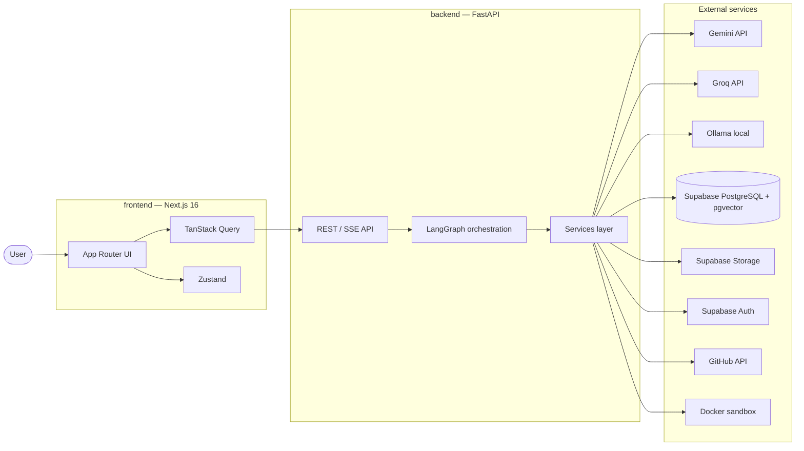

# Architecture

System design for the AI Software Engineering Team platform.

**Phase:** 1 — Foundation Setup  
**Status:** Frontend initialized; backend, agents, and integrations are planned (not yet implemented).

For AI agent coding rules, see [`AGENTS.md`](../AGENTS.md) at the repository root.

---

## 1. Overview

The platform accepts a user prompt describing software to build, orchestrates multiple AI agents that collaborate like a software engineering team, and produces reviewable, deployable artifacts.

```
User prompt → Frontend UI → Backend API → LangGraph agents → LLMs + tools → Artifacts
```

**Design goals**

- Clear separation between UI, API, and agent orchestration
- Production-style quality over demo shortcuts
- Secrets and privileged operations stay server-side only
- Each package in the monorepo runs independently in development

---

## 2. Monorepo layout

```
ai-software-engineering-team/
├── frontend/     # Next.js 16 — UI and client state only
├── backend/      # FastAPI + LangGraph — API and agent orchestration
├── docker/       # Sandbox and local service definitions
├── docs/         # Architecture, API contracts, runbooks
├── AGENTS.md     # Cursor AI guidance
├── .env.example  # Environment variable template (no secrets)
└── README.md
```

| Package   | Responsibility                                      | Must not do                          |
|-----------|-----------------------------------------------------|--------------------------------------|
| `frontend/` | Render UI, client state, call backend API         | Call LLMs, hold service-role keys    |
| `backend/`  | HTTP API, LangGraph, LLM/tool integrations      | Serve React or static frontend assets |
| `docker/`   | Sandbox images, compose files for local dev       | Contain application business logic   |
| `docs/`     | Design decisions and operational documentation    | Contain runtime code                 |

---

## 3. System diagram



---

## 4. Request flow

### 4.1 Typical user journey (target state)

1. User submits a prompt in the Next.js UI.
2. Frontend sends the request to `POST /api/v1/...` on the FastAPI backend (via TanStack Query).
3. Backend validates auth, creates a job/run record (Supabase), and starts a LangGraph workflow.
4. Agents plan, generate code, review, and iterate — calling LLMs through a provider abstraction.
5. Backend streams progress to the frontend (SSE or polling) for live updates.
6. Artifacts are stored (Supabase Storage / GitHub) and surfaced in the UI.
7. Destructive actions (git push, sandbox writes) require human-in-the-loop approval.

### 4.2 Phase 1 scope

Phase 1 establishes repository structure, standards, and a runnable frontend. The following are **documented but not implemented** until later phases:

- LangGraph agent graphs
- LLM provider integrations
- Supabase schema and auth flows
- Docker sandbox execution
- GitHub API integration

---

## 5. Frontend architecture

**Stack:** Next.js 16, TypeScript, Tailwind CSS v4, shadcn/ui (planned), Zustand, TanStack Query

**Structure — Option B (no `src/` directory):**

```
frontend/
├── app/           # App Router — layouts, pages, Server Components
├── components/    # Shared UI (shadcn/ui in components/ui/)
├── lib/           # API client, query client, utilities
├── hooks/         # Custom React hooks
├── stores/        # Zustand stores
└── public/        # Static assets
```

**Conventions**

- Server Components by default; `'use client'` only when needed.
- All backend calls go through `lib/api/` using TanStack Query.
- Path alias `@/*` resolves to the `frontend/` root.
- Turbopack is the default dev bundler.

**Environment variables**

- Only `NEXT_PUBLIC_*` variables are exposed to the browser.
- Backend URL and other client-safe config use the `NEXT_PUBLIC_` prefix.
- Never put API keys or Supabase service-role keys in frontend env vars.

---

## 6. Backend architecture (planned)

**Stack:** FastAPI, Python 3.12+, LangGraph, Pydantic v2

**Target structure:**

```
backend/
├── app/
│   ├── main.py           # FastAPI app factory
│   ├── api/routes/       # HTTP endpoints (/api/v1/...)
│   ├── agents/           # LangGraph graphs and agent nodes
│   ├── services/         # LLM, Supabase, GitHub, Docker clients
│   ├── models/           # Pydantic request/response schemas
│   └── core/             # Config, dependencies, logging
├── tests/
└── requirements.txt
```

**Conventions**

- Routes are thin; business logic lives in services and agents.
- API versioning prefix: `/api/v1/`.
- Async-first for I/O-bound work.
- Secrets loaded from environment variables only.

---

## 7. AI agent design (planned)

Agent orchestration is owned entirely by the backend using LangGraph.

| Principle | Detail |
|-----------|--------|
| Single responsibility | Each agent has one role (e.g. planner, coder, reviewer) |
| Structured outputs | Agent-to-agent messages use JSON / Pydantic models |
| Stateful workflows | LangGraph manages transitions; no ad-hoc chaining in routes |
| Persistence | Serializable agent state stored in Supabase when needed |
| Provider fallback | Gemini → Groq → Ollama |
| Cost awareness | Smaller models for simple tasks |
| Safety | Human approval before destructive sandbox or GitHub actions |
| Embeddings | pgvector in Supabase; never computed in the frontend |

---

## 8. External services

| Service | Purpose | Accessed from |
|---------|---------|---------------|
| Google Gemini | Primary LLM | Backend only |
| Groq | Secondary LLM | Backend only |
| Ollama | Local LLM fallback | Backend only |
| Supabase PostgreSQL | Application data, agent state | Backend only |
| pgvector | Embeddings storage and search | Backend only |
| Supabase Auth | User authentication | Frontend (anon key) + Backend (validation) |
| Supabase Storage | Generated artifacts | Backend writes; Frontend reads via signed URLs |
| GitHub API | Repository operations | Backend only |
| Docker sandbox | Isolated code execution | Backend only |

---

## 9. Security boundaries

```
┌─────────────────────────────────────────────────────────┐
│  Browser (untrusted)                                    │
│  - NEXT_PUBLIC_* env vars only                          │
│  - Supabase anon key only (with RLS)                    │
│  - No LLM API keys, no service-role keys, no GitHub PAT │
└───────────────────────┬─────────────────────────────────┘
                        │ HTTPS
┌───────────────────────▼─────────────────────────────────┐
│  Backend (trusted)                                      │
│  - All secrets and privileged API calls                 │
│  - Auth token validation                                │
│  - LangGraph orchestration                              │
│  - Docker sandbox invocation                            │
└─────────────────────────────────────────────────────────┘
```

**Rules**

- Supabase Row Level Security (RLS) on all tables.
- Auth tokens validated server-side on protected routes.
- Docker sandbox runs with minimal privileges.
- No secrets in logs or in API responses to the client.

---

## 10. Development topology (local)

| Service | Default URL | Package |
|---------|-------------|---------|
| Frontend dev server | `http://localhost:3000` | `frontend/` |
| Backend API | `http://localhost:8000` (planned) | `backend/` |
| Ollama | `http://localhost:11434` (optional) | External |
| Supabase | Project URL from dashboard | External |

Copy `.env.example` to `.env` and fill in values before running integrated features. Never commit `.env`.

---

## 11. Phase roadmap (high level)

| Phase | Focus |
|-------|-------|
| **1 — Foundation** (current) | Monorepo, standards, frontend init, architecture docs |
| **2 — Backend scaffold** | FastAPI health API, config, test harness |
| **3 — Frontend foundation** | shadcn/ui, TanStack Query, app shell |
| **4 — Data layer** | Supabase schema, auth, RLS |
| **5 — Agents** | LangGraph workflows, LLM providers |
| **6 — Execution** | Docker sandbox, GitHub integration |
| **7 — End-to-end** | Prompt → agents → artifacts → review UI |

Phases may be adjusted; do not implement future-phase features without explicit approval (see `AGENTS.md`).

---

## 12. Related documents

| Document | Purpose |
|----------|---------|
| [`AGENTS.md`](../AGENTS.md) | AI coding rules and phase guardrails |
| [`.env.example`](../.env.example) | Environment variable template |
| [`README.md`](../README.md) | Project overview and status |

*Last updated: Phase 1 — Foundation Setup*
